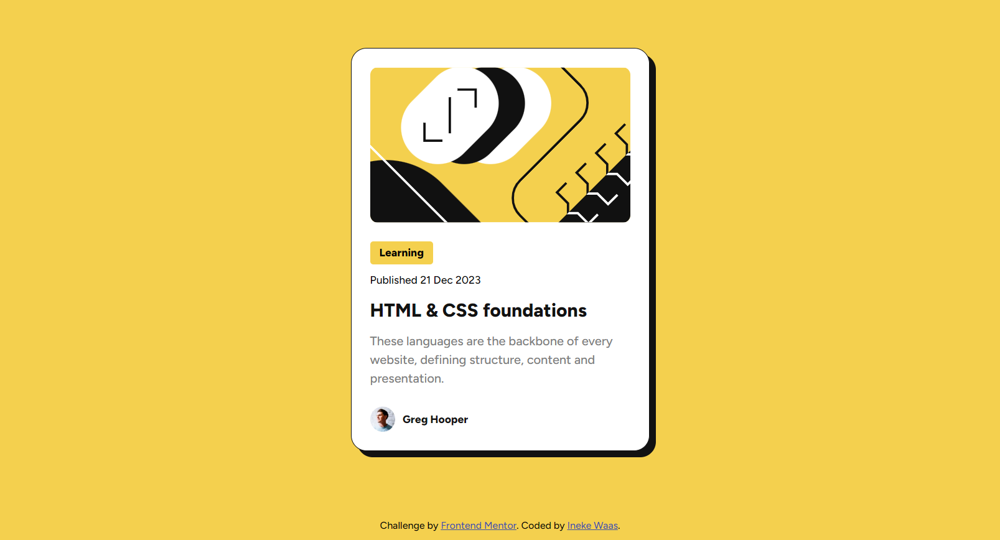
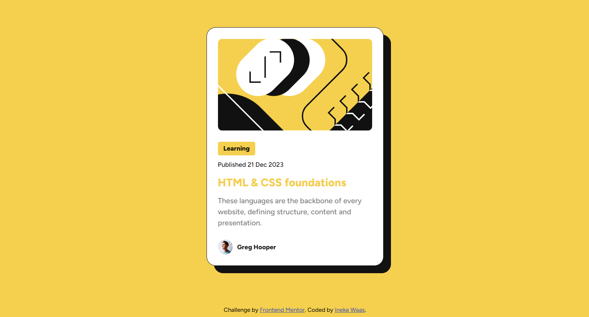

# Frontend Mentor - Blog preview card solution

This is a solution to the [Blog preview card challenge on Frontend Mentor](https://www.frontendmentor.io/challenges/blog-preview-card-ckPaj01IcS). Frontend Mentor challenges help you improve your coding skills by building realistic projects.

## Table of contents

- [Overview](#overview)
  - [The challenge](#the-challenge)
  - [Screenshot](#screenshot)
  - [Links](#links)
- [My process](#my-process)
  - [Built with](#built-with)
  - [What I learned](#what-i-learned)
  - [Continued development](#continued-development)
  - [Useful resources](#useful-resources)
- [Author](#author)

## Overview

### The challenge

Users should be able to:

- See hover and focus states for all interactive elements on the page

### Screenshot

Screenshot desktop


Screenshot hover


### Links

- Solution URL: [Add solution URL here](https://your-solution-url.com)
- Live Site URL: [https://ineke84.github.io/challenge-blog-preview/](https://ineke84.github.io/challenge-blog-preview/)

## My process

### Built with

- Semantic HTML5 markup
- CSS custom properties
- Flexbox
- Mobile-first workflow

### What I learned

One thing I learned that was very new to me was the relative font sizes and spacing. I did know about rem vs pixels, but not the effect that it has on accessability and how to use rem for a responsive website.

This has also been the first project where I'm using css properties for fonts and colors and thinking about how to make them easy to change in the future. The naming of colors and font-sizes will be something that I will use more often:

```css
:root {
	--color-primary: hsl(47, 88%, 63%);
	--color-text-light: hsl(0, 0%, 50%);
	--color-text-dark: hsl(0, 0%, 7%);
	--color-border: hsl(0, 0%, 7%);
	--color-link: hsl(228, 45%, 44%);

	--font-size-heading: 1.25rem;
	--font-size-medium: 0.875rem;
	--font-size-small: 0.75rem;
}
```

A new css function for me is clamp(). I have made some use of it in this project. However I'm still in doubt if I did it correctly and I could probably use it even more.

I forgot alt text with my images (again), next time I should really keep this in mind.

### Continued development

I want to further improve on using clamp() and creating accessable responsive websites.

One thing I'm not really happy about in this project is way of positioning the blog card and the line with the attribution at the bottom. I want the card vertically centered in the middle and the attribution at the bottom of the screen. When the screen gets smaller it should still be below the card and not fall on top of it. I did it with flexbox, but I'm wondering if there is a better way to fix this.

I also want to get more indepth knowledge of transitions. I fixed the hover effect, but don't grap the full concept yet.

### Useful resources

The information about using rem I got from:

- [Using rem doesn't make your website responsive, here's why](https://dev.to/marcelluscaio/using-rem-doesnt-make-your-website-responsive-heres-why-4b0e) - Article on dev.to by Caio Marcellus Cabral that inspired me to use css properties for font-sizes and made me understand the effect of rem on accessability.
- [Please stop using px for font-size](https://www.youtube.com/watch?v=xCSw6bPXZks) - Video by Coder Coder
- [Modern Fluid Typography Using CSS Clamp](https://www.smashingmagazine.com/2022/01/modern-fluid-typography-css-clamp/) - Article by Adrian Bece that explains how to use clamp() with font-sizes.

## Author

- Frontend Mentor - [@Ineke84](https://www.frontendmentor.io/profile/Ineke84)
